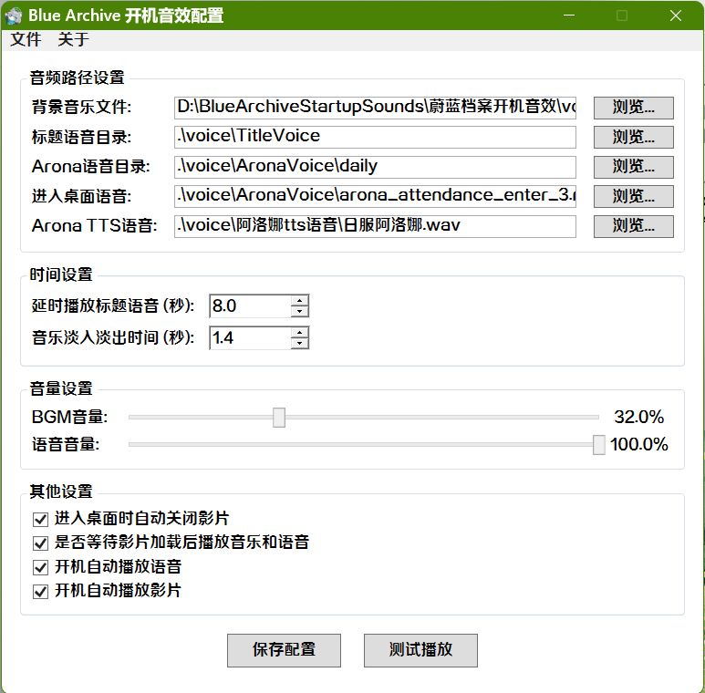

# Group-Geetest-Verify
一个AstrBot的入群验证码插件，使用极验Geetest V4验证，有效防止机器人入群。仅支持aiocqhttp

  
  
  
  
  
  
  

  
  
一个快捷设置蔚蓝档案开机音效和动画的小程序，使用
C#编写。

# 效果展示

  

# 使用方法
1. 前往[Release](https://github.com/VanillaNahida/BlueArchiveStartupSounds/releases)下载最新的程序包，将其放在一个目录下双击运行，简单配置一下即可。

# bug反馈
如果在使用过程中遇到任何问题，请通过以下方式反馈：
- [Issue](https://github.com/VanillaNahida/BlueArchiveStartupSounds/issues)
- QQ群：
  * [1074471035](https://qm.qq.com/q/eGYIxyLRtu)
  * [195260107](https://qm.qq.com/q/1od5TMYrKE)

# QQ群：
 - 一群：[621457510](https://qm.qq.com/q/wah3bmJ2M0)
 - 二群：[1031065631](https://qm.qq.com/q/wah3bmJ2M0)
 - 三群：[195260107](https://qm.qq.com/q/1od5TMYrKE) （推荐）
 - 四群：[1074471035](https://qm.qq.com/q/eGYIxyLRtu)（推荐）

# 特别感谢
 - [SiyuanX237/LockEngine](https://github.com/SiyuanX237/LockEngine) 锁屏动画实现，本项目程序引用了该组件

# Star History

